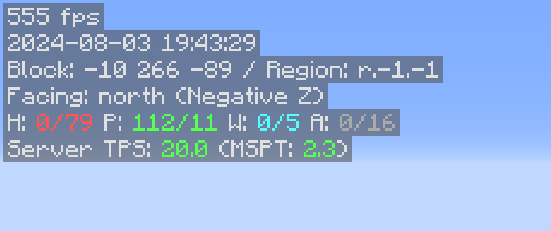

# MicroHUD
This is a small mod that adds useful info lines to your HUD, kind of like [masa's MiniHUD](https://github.com/maruohon/minihud).
 This mod is made for Forge 1.7.10, specifically for the [Historical SMP](https://discord.gg/4ySWkM2).

## Configuration
The mod can be configured under "Mod Options". You can enable/disable the HUD, enable potion effects HUD and more.
 There is also a separate category for configuring which lines to show, and another category for you to define their order.
 Additionally, you can also (kind of) change how the HUD looks, although it's very limited at the moment.

## Dependency
> [!IMPORTANT]
> This mod needs a Mixin bootstrap mod to work.

My recommendation is [UniMixins](https://modrinth.com/mod/unimixins). Other Mixin bootstrap mods will work too.